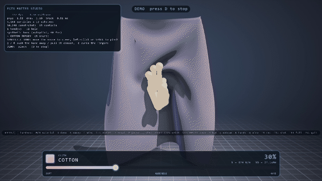
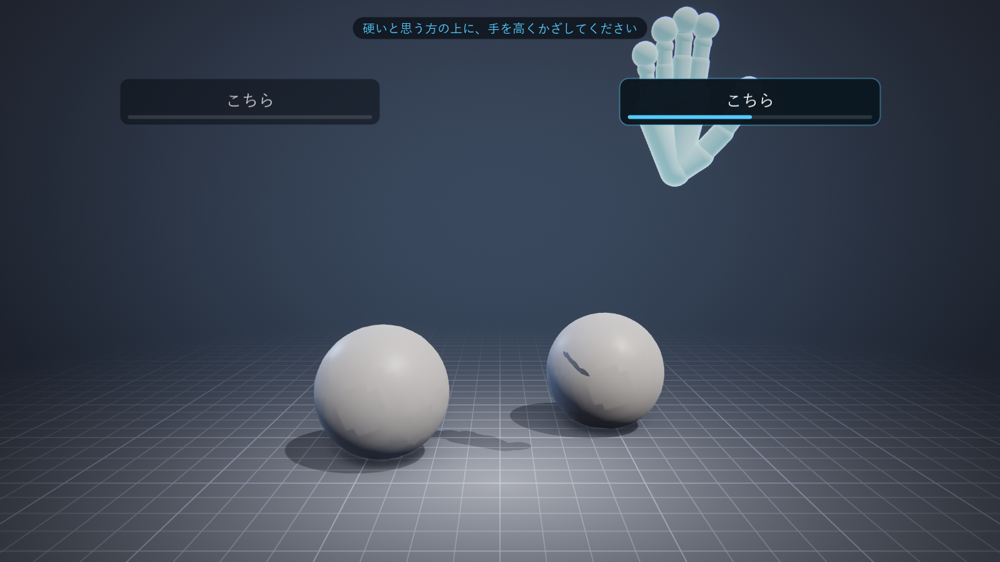
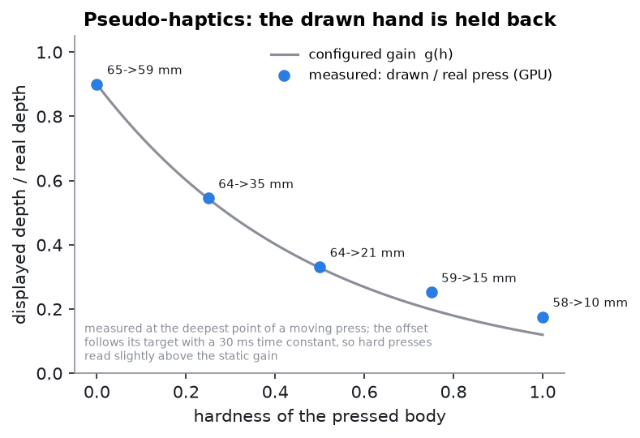
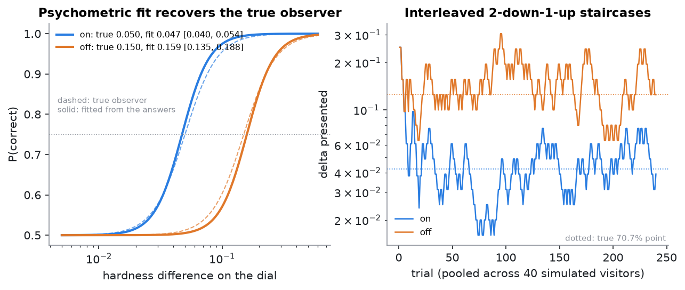
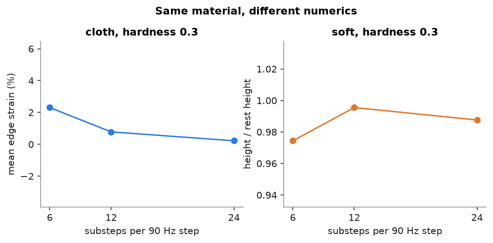
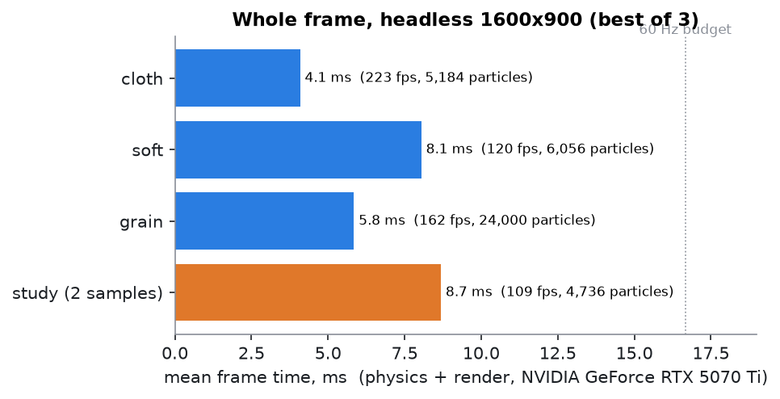
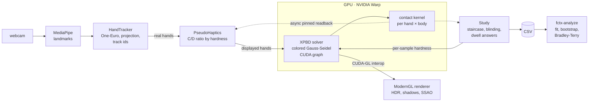

# FCTX MATTER STUDIO

**English** | [日本語](README.ja.md)

[](https://github.com/futurecortexlabs/FCTX-MATTER-STUDIO/actions/workflows/ci.yml)
[](LICENSE)


**Touchless sensory evaluation of materials, with a webcam and your bare hands.**

GPU soft-matter physics you can pinch, press and lift with bare hands in front
of an ordinary webcam; a pseudo-haptic hand that is *held back* by hard
materials; and a built-in psychophysics lab that runs blind A/B tests on
simulated materials and tells you, with confidence intervals, what people can
feel.

<p align="center"></p>

<p align="center"><sub>One sheet, one grip. The dial moves from gossamer to sheet metal while the
hand is still holding it -- the fold, the swing and the drape all change,
because the dial is Young's modulus, not a colour.</sub></p>

---

## Why this exists

A materials company that wants to know *can customers tell these two foams
apart?* or *which of these three do they prefer?* normally makes the foams and
recruits a panel. This runs the panel on simulated samples instead -- at a
trade-show booth, on visitors, with nothing to touch but air:

| | Usual practice | FCTX MATTER STUDIO |
|---|---|---|
| Samples | Physical prototypes | Simulated, specified by Young's modulus (or your own catalogue) |
| Conveying hardness | Touch the real thing | **Pseudo-haptics**: the drawn hand is resisted by hard samples |
| Answering | Paper or tablet | **Raise a hand over your choice** -- no touch, no mouse |
| Design | Hand-assigned | 2AFC + **adaptive staircase**, sides and conditions randomised |
| Results | Tabulated later | **JND, modulus Weber fraction, Bradley–Terry ranking**, automatically |
| Does the illusion work? | -- | Measured **in the same run**: on/off interleaved, effect with a bootstrap CI |

<p align="center"></p>

## Technical highlights

- **XPBD solver written from scratch in NVIDIA Warp** -- not `warp.sim`. Cloth
  (stretch, shear, dihedral bending), soft bodies (stable Neo-Hookean
  tetrahedra, Macklin & Müller 2021) and 24,000-grain granular matter are one
  solver with different constraint sets, so a single scalar rewrites every
  compliance in the scene mid-grab without rebuilding anything.
- **Parallel Gauss–Seidel by graph colouring**, the substep loop captured as a
  **CUDA graph** (dynamic values live in device arrays so the graph stays
  valid), Jacobi-averaged particle contacts with count-faded SOR, a hash grid.
- **Embedded render skin**: the drawn surface is a smooth fitted mesh bound to
  eight incident tetrahedra per vertex by barycentric blending, so a coarse
  lattice renders as a sphere, not a staircase.
- **Bare-hand interaction**: MediaPipe landmarks → One-Euro filtering →
  image-to-world projection → 21 capsule colliders per hand, swept across
  substeps, speed-limited, faded in so a hand never materialises inside matter;
  wrist-anchored grabs with palm-frame rotation so opening the fingers never
  flings what they held.
- **Pseudo-haptics** with a per-(hand, body) contact kernel read back through
  **double-buffered pinned memory and CUDA events** -- zero measured frame cost.
- **Custom ModernGL renderer**: HDR, MSAA, shadow maps with per-receiver bias,
  SSAO, progressive bloom, ACES, a single-draw-call HUD with a CJK label cache,
  CUDA–GL interop for zero-copy particle upload.
- **Deterministic lockstep**: headless runs are bit-reproducible, which is what
  the test suite and the video renderer stand on.
- **Built for unattended operation**: camera hot-plug recovery, attract mode,
  a resilient frame loop, scheduled restarts only when nobody is there,
  a soak-test tool, visitor analytics.

## Evidence

Every number below is produced by [`tools/make_figures.py`](tools/make_figures.py)
and stored in [`docs/figures/measurements.json`](docs/figures/measurements.json).

<table>
<tr>
<td width="50%"></td>
<td><b>Pseudo-haptics through the real solver.</b> A hand pressed ~60 mm into
the soft body at five hardnesses. Soft: drawn 59 of 65 mm (0.90, as
configured). Hard: drawn 10 of 58 mm. The measured ratio follows the
configured gain; at the hard end it reads a little high because the offset
follows its target with a 30 ms time constant during a moving press.</td>
</tr>
<tr>
<td></td>
<td><b>The analysis recovers known truth.</b> Simulated visitors with known
thresholds (0.050 with pseudo-haptics, 0.150 without) answer 480 trials through
the real study state machine. Fitted: 0.047 [0.040, 0.054] and 0.159
[0.135, 0.188]; effect ratio 3.36 [2.73, 4.32] against a true 3.00.</td>
</tr>
<tr>
<td></td>
<td><b>An honest limit.</b> XPBD's compliance makes the <i>converged</i>
material independent of the substep count, but one iteration per substep is
not fully converged: a hanging sheet at hardness 0.3 shows 2.3% / 0.78% /
0.22% edge strain at 6 / 12 / 24 substeps. A resting soft body stays within 2%.
The default is 12; studies should not change it.</td>
</tr>
<tr>
<td></td>
<td><b>Whole frames, not just physics.</b> Headless 1600×900, physics +
rendering, best of three runs on a shared RTX 5070 Ti workstation: every
configuration fits a 60 Hz frame with room to spare, including the
two-sample study with pseudo-haptics on.</td>
</tr>
</table>

## Quick start

Windows with an NVIDIA GPU (CUDA 12 driver) and any webcam:

```bat
setup.bat
```

or by hand, on Windows or Linux:

```bash
uv sync
uv run python tools/download_models.py     # MediaPipe hand model, sha256-checked
uv run fctx --check                        # GPU, OpenGL, model, camera
uv run fctx                                # free play: cloth (1-5 switch presets)
uv run fctx --demo                         # the choreographed demonstration
uv run fctx --source synthetic             # no camera: mouse-driven hand
```

Run a study and analyse it:

```bash
uv run fctx --study studies/hardness_jnd.toml --kiosk
uv run fctx-analyze studies/results/hardness_jnd.csv --plot jnd.png
```

```
DISCRIMINATION  (threshold = hardness-dial difference at 75% correct)
  pseudo-haptics  on:  120 trials,  14 people, 78% correct
      threshold 0.071 [0.058, 0.090]  staircase 0.066  -> modulus Weber fraction 72%
  pseudo-haptics off:  120 trials,  14 people, 71% correct
      threshold 0.118 [0.091, 0.160]  staircase 0.109  -> modulus Weber fraction 145%
  pseudo-haptics effect: threshold off/on = 1.66 [1.18, 2.35]  -> helps
```
<sub>Output format only -- illustrative numbers, not a result.</sub>

## What you can use it for

- **Pre-screening materials** before making prototypes: which differences are
  noticeable at all, which of a shortlist people prefer. Bring your own
  catalogue (`--catalog materials.toml`, Young's modulus per entry).
- **HCI and perception research**: pseudo-haptics, visual stiffness perception,
  bare-hand interaction -- with a validated staircase, reproducible CSV logs and
  deterministic replay of recorded hand motion (`--record` / `--source replay`).
- **Exhibitions and teaching**: `--kiosk` runs unattended for days; the demo,
  attract mode, visitor prompts (any language) and a daily report are built in.

## Architecture



The design, the maths, every stability rule and the known limits (with
measurements) are in [docs/ARCHITECTURE.md](docs/ARCHITECTURE.md). Running an
installation or a study: [docs/OPERATIONS.md](docs/OPERATIONS.md) (Japanese).

## Limits, stated plainly

- **Not yet validated on people.** Whether pseudo-haptics helps with a webcam
  hand, and whether judgements on simulated samples match judgements on real
  ones, are exactly what this tool measures -- they are not claims. Tying
  results to products needs one panel with physical samples of known modulus.
- **Stiffness ceiling.** Above ~0.4 on the soft dial the tetrahedra reach their
  resolvable stiffness; ordering holds, the modulus ratio becomes nominal
  (the analysis warns).
- **Granular friction is weak** (position-based friction vanishes at rest), so
  piles spread; the grain preset ships with a basin. Measured in ARCHITECTURE §10.
- **NVIDIA GPU required** for physics and rendering; the tracking, study and
  analysis code runs anywhere (that is what CI runs).

## Tests

```bash
uv run python tools/run_tests.py          # 18 files, ~380 checks (GPU, ~4 min)
uv run python tools/run_tests.py --cpu    # what CI runs on every push
```

Tests are named as the property they defend -- `a_hard_surface_holds_the_drawn_hand_back_and_a_soft_one_lets_it_sink`,
`the_study_recovers_a_known_threshold`, `lockstep_makes_a_headless_run_reproducible`,
`opening_the_fingers_does_not_fling_what_they_were_holding`.

## Credits

- NVIDIA Warp (Apache-2.0), MediaPipe Hands (Apache-2.0; the model is
  downloaded and hash-checked, not redistributed), ModernGL (MIT), OpenCV (Apache-2.0)
- Macklin, Müller & Chentanez, *XPBD* (2016); Macklin et al., *Small Steps in
  Physics Simulation* (2019); Macklin & Müller, *Stable Neo-Hookean* (2021)
- Casiez, Roussel & Vogel, *1€ Filter* (2012); Lécuyer et al., *pseudo-haptic
  feedback* (2000); Levitt, *transformed up-down methods* (1971); Hunter,
  *MM algorithms for Bradley–Terry* (2004)

MIT licensed. If you use it in research, see [CITATION.cff](CITATION.cff).
