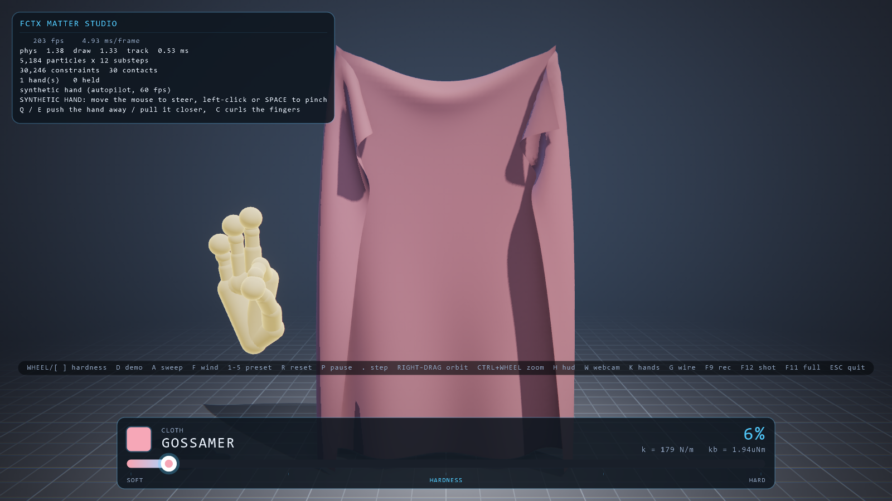
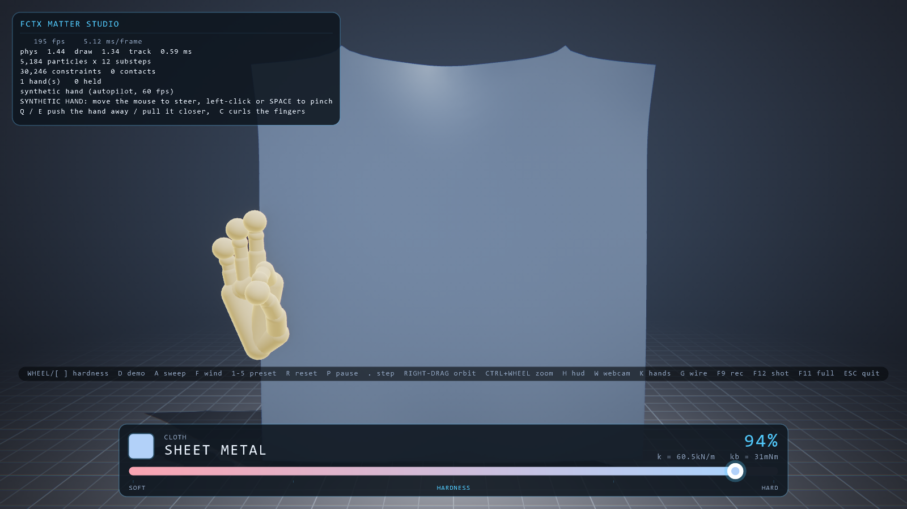
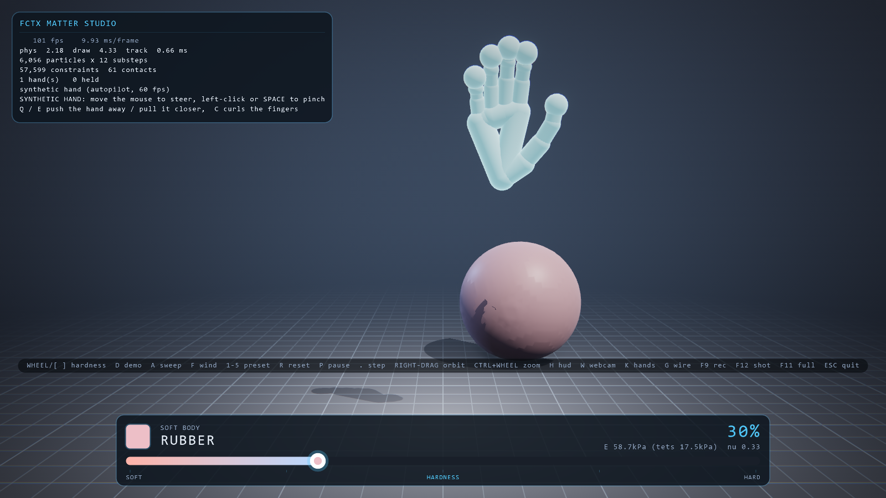
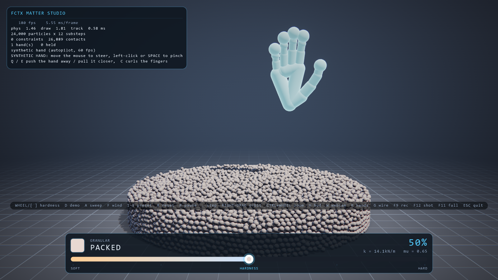

# FCTX MATTER STUDIO

**触れない官能評価ラボ。Web カメラ一台で、素材の「硬さ」を比べて測る。**

素材メーカーが「お客さまはこの二つのフォームの違いがわかるか」「三つのうちどれが好まれるか」を
知りたいとき、ふつうは試作品を作ってパネル（評価者）を集めます。このソフトは、そのパネルを
**シミュレーション上の試料で、試作なしに、展示会場で来場者を相手に**回します。

| | 既存のやり方（試作＋パネル／TouchDesigner 等の展示） | FCTX MATTER STUDIO |
|---|---|---|
| 試料 | 実物を試作 | ヤング率を指定した仮想試料（自社カタログも可） |
| 硬さの伝え方 | 実物に触る／展示では色や見た目 | **疑似触覚**：画面の手が硬さに応じて押し返される |
| 回答 | 用紙・タブレット | **手をかざすだけ**（触らない・マウスなし） |
| 実験計画 | 人手で割り付け | 二肢強制選択＋**適応型階段法**、左右と条件を自動で無作為化 |
| 結果 | 集計は後で手作業 | **弁別閾・ヤング率のウェーバー比・Bradley–Terry 順位**を自動解析 |
| 疑似触覚そのものの効果 | — | 試行ごとに on/off を交互に出し、**効果の大きさと信頼区間を同じ実験で測る** |


### 新しい点

1. **疑似触覚（pseudo-haptics）**。手が試料に触れると、画面に描く手を素材の硬さに応じて押し返します
   （制御表示比の操作。Lécuyer ら 2000 年以来の研究手法）。GPU 上の実測で、硬い試料に 19 mm 押し込むと
   画面の手は 2 mm しか沈まず、柔らかい試料では 66 mm に対して 59 mm 沈みます（接触の読み出しは非同期で、
   有効にしてもフレーム時間は測定誤差の範囲：8.1–8.4 ms）。ソルバがぶつかる手も
   同じ「押し返された手」なので、画面と物理が食い違いません。
2. **ブラインド A/B 官能評価**。同じ形・同じ色の試料を左右に並べ、ダイヤルも素材名も隠します。違うのは
   押したときの振る舞いだけです。来場者は両方を押してから、選んだ方の上に手を高くかざします（1.2 秒の
   注視で確定）。
3. **展示会でも科学的に回る**。来場者をまたいで一本の階段法を続け、再起動しても CSV から続きを
   再開します。途中で立ち去った人の回答はそこまでで確定します。
4. **疑似触覚が本当に効くかを測れる**。効く「はず」とは言いません。条件を交互に出し、
   `threshold(off) / threshold(on)` とブートストラップ信頼区間で判定します。

```bash
uv run python -m fctx --study studies/hardness_jnd.toml --kiosk        # 弁別閾（どちらが硬い？）
uv run python -m fctx --study studies/foam_preference.toml --kiosk     # 好み（どちらが好き？）
uv run python tools/analyze_study.py studies/results/hardness_jnd.csv --plot jnd.png
```

解析の妥当性は、閾値が既知の模擬観察者で確かめています（真値 0.080 に対して推定 0.078、95% 区間
[0.069, 0.092]。効果が 3 倍ある条件差は off/on = 3.81 [2.84, 4.69] で検出）。

**まだ言えないこと**：人を相手にした検証はこれからです。このカメラ構成で疑似触覚が弁別を
助けるかどうか、シミュレーション試料での判断が実物での判断とどれだけ一致するか（実物パネルとの
突き合わせ）は、このツールで測るべき問いであって、結論ではありません。制約の全体は
[docs/ARCHITECTURE.md](docs/ARCHITECTURE.md) §9c と §10 にあります。

---

## 土台：画面内の物質を、素手で操る

カメラの前で手を動かすと、画面の中の布をつまめます。柔らかい物体を押せばへこみ、
指を離せば揺れながら戻ります。マウスもコントローラも使いません。

そして見せ場は、**物を掴んでいる最中に「硬さ」を連続的に変えられる**ことです。
色が変わるだけではありません。同じ形のまま、たわみ方が変わり、手を離した後の
揺れ方が変わり、床への落ち方が変わります。

| 硬さ 6%「GOSSAMER」 | 硬さ 94%「SHEET METAL」 |
|---|---|
|  |  |

**同じ布、同じソルバ、同じフレーム。動かしたのはダイヤルだけです。**
面外の折れ幅は 0.124 m から 0.036 m に、垂れ下がりは床まで届く状態から
ほぼ真っ直ぐに変わります。色はその結果を読みやすくしているだけで、
形を決めているのはヤング率と曲げ剛性です。

| 弾性体 | 粒体 24,000 |
|---|---|
|  |  |

---

## これは何か

物理は全部ひとつのパーティクルソルバです。布も弾性体も粒体も別エンジンではなく、
**同じ XPBD ソルバに違う拘束を掛けているだけ**です。だから「硬さ」という 1 つの
スカラーが、シーン中の全拘束のコンプライアンス（＝剛性の逆数）をその場で書き換え
られます。再構築も、シミュレーションの中断も要りません。

コンプライアンスは物理量です。XPBD は解く際に `α̃ = α/Δt²` として畳み込むので、
**サブステップ数を変えても材質の手触りは変わりません**。硬さダイヤルが動かして
いるのはヤング率とポアソン比そのものであって、数値解法のごまかしではありません。

ただしダイヤルの上端は文字どおりではありません。四面体 1 個が 1 回の投影で
解ける剛性には離散化由来の上限があり、同梱の弾性体プリセットでは硬さ 0.4 付近
からその上限に当たります。超えた分は四面体の辺拘束が担うので手応えは硬くなり
続けますが、HUD の `E` は「要求値」であって実効値ではなく、最上端では立方体が
静止形状より 22% 太って落ち着きます。測定値と理由は
[docs/ARCHITECTURE.md](docs/ARCHITECTURE.md) §6.4 と §10 に書いてあります。

| 層 | 実装 |
|---|---|
| GPU 物理 | NVIDIA Warp 1.17 の自作 XPBD カーネル（`warp.sim` は使用しない／1.x で削除済み） |
| 弾性体 | Stable Neo-Hookean 四面体（Macklin & Müller 2021）。ヤング率とポアソン比で駆動 |
| 布 | 構造・せん断距離拘束 ＋ 二面角曲げ拘束 |
| 接触 | 手＝カプセル列、空間ハッシュによる粒子間衝突、クーロン摩擦 |
| 並列化 | グラフ彩色による並列 Gauss-Seidel ＋ CUDA Graph キャプチャ |
| ハンドトラッキング | MediaPipe Hands（21 ランドマーク）＋ One-Euro フィルタ |
| 描画 | ModernGL 自作パイプライン。PBR / シャドウ / SSAO / Bloom / ACES |

詳細な設計と数式は [docs/ARCHITECTURE.md](docs/ARCHITECTURE.md) にあります。

---

## 動かす

必要なもの: NVIDIA GPU（CUDA）、Python 3.12、ウェブカメラ（無くても動きます）。

```bash
uv sync
uv run python tools/download_models.py
uv run python -m fctx
```

**まず見せ場を見る**（掴む → 持ち上げる → 持ったまま硬さを端から端へ → 離す、を布と弾性体で）:

```bash
uv run python -m fctx --demo --source synthetic
```

`D` キーで実行中いつでも開始／停止できます。同じ振り付けを映像に落とすには:

```bash
uv run python tools/render_showcase.py            # docs/showcase.mp4, 1600x900 60fps H.264
```

ヘッドレスのロックステップで走るので、どのマシンでもフレーム単位で同じ映像になります。

環境に問題がないか先に見たいとき:

```bash
uv run python -m fctx --check
```

カメラが無い場合は自動的に**合成ハンド**に切り替わります。マウスで手を動かし、
クリックまたはスペースでつまめます。デモも回帰テストもこれで完結します。

```bash
uv run python -m fctx --source synthetic
```

### よく使うコマンド

```bash
uv run python -m fctx --preset soft          # 弾性体
uv run python -m fctx --preset banner        # 風になびく旗
uv run python -m fctx --preset grain         # 粒体
uv run python -m fctx --hardness 0.9         # 硬い状態から開始
uv run python -m fctx --record take01.fhr    # 手の動きを記録
uv run python -m fctx --source replay --replay take01.fhr
uv run python -m fctx --benchmark            # ヘッドレス計測
```

---

## 実測値

RTX 5070 Ti / Warp 1.17 / 90 Hz × 12 サブステップ（実効 1080 Hz）。
1 フレームの予算は 11.1 ms です。

| プリセット | 粒子 | 拘束 | physics | render | fps |
|---|---:|---:|---:|---:|---:|
| cloth 72×72 | 5,184 | 30,246 | **1.0 ms** | 1.3 ms | 207 |
| banner 88×88 | 7,744 | 45,414 | 1.1 ms | 1.3 ms | 198 |
| soft sphere 21³ | 6,056 | 57,599 | 2.2 ms | 4.5 ms | 96 |
| granular | 24,000 | 26,800 接触 | 1.1 ms | 1.5 ms | 199 |

（`--benchmark` の実測。Blender と Isaac Sim が常駐した状態の値で、GPU が空いていると
cloth は 300 fps 近くまで出ます。render は GL タイマークエリによる GPU 実時間です。）

ダイヤルが実際に効いていることの数値的裏付け（すべて回帰テストで検証）:

| 物質 | 硬さ 0 | 硬さ 1 |
|---|---|---|
| 布・面外の折れ幅 | 0.124 m | 0.036 m |
| 弾性体・ヤング率 | 6 kPa | 12 MPa（3.3 桁） |
| 弾性体・垂れ量 | 249.5 mm | 220.2 mm |
| 粒体・安息角 / 広がり | 9.9° / 0.39 m | 3.3° / 1.14 m |

弾性体の描画表面は物理格子ではありません。ボクセル格子は well-conditioned の
まま残し、等値面上の「理想位置」を各頂点が接する最大 8 個の四面体に barycentric で
埋め込み、その平均（線形ブレンドスキニング）として毎フレーム再構成しています。
同梱の球で表面の半径ばらつきが **6.0 mm → 0.12 mm（50 倍）**、要素境界の折れも
消え、物理側は一切変えていません。

HUD の `E` は正直です。四面体 1 個が 1 サブステップで解ける剛性には離散化上の
上限があり、それを超えるとソルバは要素を柔らかくして辺拘束に残りを担わせます。
その時 HUD は `E 125kPa (tets 17.7kPa)` のように**実際に四面体が担っている値**を
併記します。

---

## 実務で使う（展示・授業・実験室）

会場ごとの設定は TOML ファイルに、常設は `--kiosk` に集約してあります。
詳細は **[docs/OPERATIONS.md](docs/OPERATIONS.md)**（機材・設置・キャリブレーション・
トラブルシューティング）。

```bash
setup.bat                                          # 新品 PC の初回セットアップ（uv→依存→モデル→check）
uv run python tools/calibrate.py --camera 0        # 会場の手のサイズと位置を計測
uv run python -m fctx --dump-config > venue.toml   # 既定値を書き出して編集
uv run python -m fctx --config venue.toml --check  # 設定ファイルと機材を本番前に確認
uv run python -m fctx --config venue.toml --kiosk  # 常設モード
run_kiosk.bat                                      # 落ちても再起動する監視ループ
uv run python tools/soak.py --minutes 45           # 常設前のソークテスト（メモリの増加量を出す）
```

`--kiosk` はフルスクリーン、**アトラクトモード**（20 秒無人で自動デモ、手が映れば即復帰）、
**カメラ切断からの自動復帰**（3 秒ごとに再接続）、**フレーム耐性**（例外をログしてシーンを
リセットし続行）、**定期再起動**（12 時間後、無人になった瞬間に正常終了して監視ループが立て直す）、
**コーチ**（来場者への短い案内、日本語可）、**記録**（`logs/events.csv` → `tools/report.py` で日報）を
同時に有効にします。

来場者はマウスに触りません：**片手で持ったまま、もう片方の手を上げ下げすると硬さが変わります**
（片手だけの会場は「持っている間は自動で往復」に切替可）。HUD にはダイヤル位置に最も近い素材名
（内蔵カタログ、または自社素材の `materials.toml`）が出ます。設定ファイルのタイポは起動時にキー名を挙げて
エラーになります。

---

## 操作

| 入力 | 動作 |
|---|---|
| **ホイール** / `[` `]` | **硬さダイヤル**（押しっぱなしで連続変化。`-` `=` と `↑` `↓` も同じ） |
| `D` | **振り付けデモ**：掴む→持ち上げ→保持したまま硬さ掃引→離す（合成ハンド時。カメラ時はダイヤルのみ） |
| `Z` / `X` | スタディ中：左／右をスタッフが代理回答 |
| `A` 自動スイープ（デモ・録画用） / `0` 一番柔らかい端へ | |
| `1`–`5` | プリセット切替（cloth / banner / soft / cube / grain） |
| 右ドラッグ | カメラ回転 / `Ctrl`+ホイール ズーム |
| `R` 再構築 / `P` 一時停止 / `.` コマ送り | |
| `H` HUD / `W` カメラ映像 / `K` 手の骨格 / `G` ワイヤフレーム / `F` 風 | |
| `F9` 録画 / `F12` スクリーンショット / `F11` 全画面 / `Esc` 終了 | |
| （合成ハンド）マウス移動・左クリック / `Space` つまむ・`Q`/`E` 奥行き・`C` 握る | |

---

## 設計上の判断

**なぜ `warp.sim` を使わないのか。** Warp 1.x で削除されているからです。距離拘束、
二面角、Neo-Hookean、接触、彩色スケジューリングはすべて自前の `@wp.kernel` です。
これは制約ではなく、仕様書が言う「自然な手操作との統合部分は独自開発」の中身そのもの
です。

**なぜ反復回数ではなくサブステップなのか。** XPBD は「1 ステップ × 12 反復」より
「12 サブステップ × 1 反復」の方が圧倒的に収束します（Macklin et al. 2019）。
既定は 90 Hz × 12 サブステップ、つまり実効 1080 Hz です。

**なぜグラフ彩色なのか。** 同じ粒子を共有する 2 つの拘束を同一カーネルで並列に
解くと競合し、結果が非決定的になります。彩色すれば色ごとに競合ゼロで並列投影でき、
Gauss-Seidel の収束を保ったまま GPU を使い切れます。`greedy_color` は構築順と
次数降順の 2 通りを試して色数の少ない方を採用します（布グリッドでは構築順が勝ち、
四面体格子では次数降順が勝つことがある）。同梱の布 72×72 で距離拘束 8 色、
曲げ拘束 11 色です。

**なぜ One-Euro フィルタなのか。** ランドマークが 60 Hz で 3 mm 揺れると、それは
布に 0.18 m/s の速度インパルスを毎フレーム注入することになります。物理が正しくても
振動して見えます。One-Euro は静止時に強く、高速移動時にほぼ透明という、ここに必要な
トレードオフそのものです。

**なぜ掴みがコンプライアント拘束なのか。** 位置の直接代入にすると、手が速く動いた
瞬間に粒子が床や他の物体を貫通します。柔らかい拘束なら、引っ張れば伸びて、離せば
速度が残る——つまり投げられます。

**なぜ掴みにヒステリシスが要るのか。** 閾値が 1 つだと、静止した手でも毎秒数回
「掴む／離す」が入れ替わります。開始閾値と解放閾値を分け、さらに短い保持時間を入れる
だけで、「物を持ち上げた」という感覚になります。

---

## 最初に作る範囲について

仕様書が求めた中心は**布 1 枚と柔らかい物体 1 個の反応と安定性**で、磨き込みの
対象もそこです。液体も破壊も入れていません。

ただし実際に入っている範囲は仕様書より広い、と正直に書いておきます。プリセットは
7 つ（cloth / banner / drape / soft / cube / torus / grain）あり、粒体は
「パーティクルソルバのついで」ではありません。専用のビルダと材質、粒体のためだけに
ソルバと衝突カーネルに足した円筒バシン（`basin_radius` / `basin_height`）、粒体
プリセット専用のトラッキング体積、点スプライト描画パスを持ち、接触の Jacobi 平均と
接触数フェードの過緩和は 24,000 粒の山があるから存在します。描画も
PBR / シャドウ / SSAO / 6 段ブルーム / ACES まで入った自作パイプラインで、
リポジトリ中で最大のパッケージです。

安定性は機能要件として扱い、`docs/ARCHITECTURE.md` §7 に 9 項目のルールとして
明文化し、テストで検証しています。

---

## テスト

```bash
uv run python tools/run_tests.py            # 全部
uv run python tools/run_tests.py --cpu      # GPU 不要なものだけ
```

カメラ無しで全て走ります。物理のテストは「NaN が出ない」だけでなく、
**硬い方が柔らかい方より伸びない**という見せ場の主張そのものを数値で検証します。

---

## ライセンスと出典

- NVIDIA Warp — GPU カーネル JIT（Apache-2.0）
- MediaPipe Hands — ランドマーク推定（Apache-2.0）。モデルは配布物に含めず、
  `tools/download_models.py` が公式バケットから取得し sha256 を検証します。
- Macklin, Müller, Chentanez, *XPBD* (2016)
- Macklin et al., *Small Steps in Physics Simulation* (2019)
- Macklin & Müller, *A Constraint-based Formulation of Stable Neo-Hookean Materials* (2021)
- Casiez, Roussel, Vogel, *1€ Filter* (2012)

---

<details>
<summary><b>English summary</b></summary>

Move your bare hands in front of a webcam and the matter on screen answers.
Pinch a sheet of cloth and it creases under your fingers. Push a soft body and
it dents, then wobbles back when you let go.

The showpiece: **change the hardness continuously while you are still holding
the object.** Not just its colour — the same shape stops folding like jelly and
starts folding like rubber, wobbles differently after release, and hits the
floor differently.

Everything on screen is one particle system. Cloth, soft bodies and granular
matter are not three engines; they are one XPBD solver running different
constraint sets over the same buffers. "Hardness" is a single scalar that
rewrites the compliance of every constraint in the scene, live, mid-grab.
Because compliance is physical and XPBD folds it in as `α̃ = α/Δt²`, the feel of
the material does not change when the solver takes more or fewer substeps. The
top of the dial is not literal, though: one tetrahedron can only resolve so
much stiffness per projection, the shipped soft presets reach that around
hardness 0.4, and past it the extra hardness is carried by the tet edge
constraints rather than by the Neo-Hookean pair — measured in ARCHITECTURE
§6.4 and §10.

Custom Warp kernels (no `warp.sim` — it was removed in Warp 1.x): XPBD distance
and dihedral bending constraints, stable Neo-Hookean tetrahedra driven by
Young's modulus and Poisson's ratio, capsule and spatial-hash contact with
Coulomb friction, graph-coloured parallel Gauss-Seidel, CUDA graph capture.
MediaPipe hand tracking with One-Euro filtering. A hand-written ModernGL
pipeline: PBR, shadows, SSAO, progressive bloom, ACES.

See [docs/ARCHITECTURE.md](docs/ARCHITECTURE.md) for the full design, the
maths, and the stability rules.

```bash
uv sync && uv run python tools/download_models.py
uv run python -m fctx --check
uv run python -m fctx                      # live camera
uv run python -m fctx --source synthetic   # no camera needed
```

</details>
